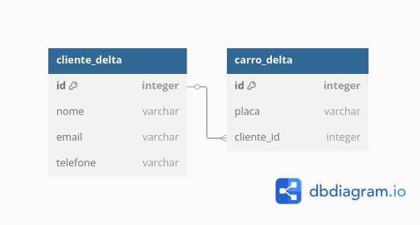

 
# Delta Lake com Apache Spark

Este documento apresenta o uso do Delta Lake com Apache Spark em um cenário de gerenciamento de clientes e veículos.

## Modelo de Dados

O sistema utiliza duas tabelas principais:

- `cliente_delta`: armazena informações dos clientes.
- `carro_delta`: armazena os veículos, associados aos clientes.

### Modelo ER

Abaixo, o modelo entidade-relacionamento utilizado:



## Fonte dos Dados

Os dados utilizados neste projeto são fictícios e representam clientes e veículos de uma locadora. 

## Criação das Tabelas

```sql
CREATE TABLE cliente_delta (
  id INT,
  nome STRING,
  email STRING,
  telefone STRING
) USING delta;

CREATE TABLE carro_delta (
  id INT,
  placa STRING,
  cliente_id INT
) USING delta;
```

## Inserção de Dados

```sql
INSERT INTO cliente_delta VALUES
(1, 'Ana Souza', 'ana@email.com', '(11) 91234-5678'),
(2, 'Bruno Lima', 'bruno@email.com', '(21) 99876-5432'),
(3, 'Carla Mendes', 'carla@email.com', '(31) 98765-4321');

INSERT INTO carro_delta VALUES
(1, 'XYZ1J34', 1),
(2, 'RLC5B93', 2),
(3, 'ABC9Z88', 1);
```

## Atualização de Dados

```sql
UPDATE cliente_delta
SET telefone = '(11) 90000-0000'
WHERE id = 1;
```

## Exclusão de Dados

```sql
DELETE FROM carro_delta
WHERE id = 2;
```

## Histórico Delta Lake

```python
from delta.tables import DeltaTable
cliente = DeltaTable.forPath(spark, "./spark-warehouse/cliente_delta")
cliente.history().show(truncate=False)
```
