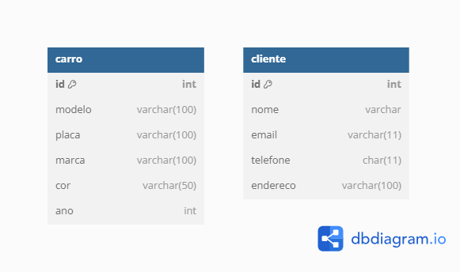

# Apache Iceberg com Apache Spark

Este documento apresenta o uso do Apache Iceberg com Apache Spark em um 
cenário de gerenciamento de clientes e veículos.

## Modelo de Dados

O sistema utiliza duas tabelas principais:

- `cliente`: armazena informações dos clientes.
- `carro`: armazena os veículos.

### Modelo ER

Abaixo, o modelo entidade-relacionamento utilizado:


## Fonte dos Dados

Os dados utilizados neste projeto são fictícios e representam clientes e veículos de uma locadora. 

## Criação das Tabelas

```sql
spark.sql(
  
  CREATE TABLE local.carro_iceberg (
    id INT, 
    placa STRING, 
    marca STRING, 
    modelo STRING, 
    ano INT, 
    cor STRING
  ) USING iceberg
 
)

spark.sql(
  
  CREATE TABLE local.cliente_iceberg (
    id INT,
    nome STRING,
    email STRING
  ) USING iceberg
 
)
```

## Inserção de Dados

```sql
  INSERT INTO local.cliente_iceberg VALUES
    (1, 'João Silva', 'joao.silva@email.com', '123456789', 'Rua A, 123'),
    (2, 'Maria Oliveira', 'maria.oliveira@email.com', '987654321', 'Avenida B, 456'),
    (3, 'Carlos Souza', 'carlos.souza@email.com', '112233445', 'Rua C, 789'),
    (4, 'Aline Lima', 'aline@email.com', '556677889', 'Rua D, 101')

    INSERT INTO local.carro_iceberg VALUES
    (1, 'ABC1234', 'Fiat', 'Uno', 2020, 'Azul'),
    (2, 'XYZ5678', 'Volkswagen', 'Gol', 2018, 'Preto')

```

## Exclusão de Dados

```sql
delete from local.cliente_iceberg where id = 3
```